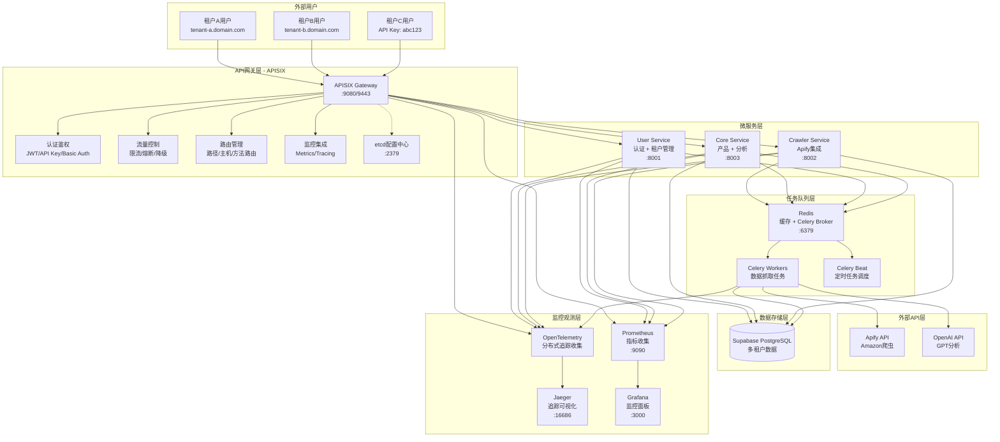
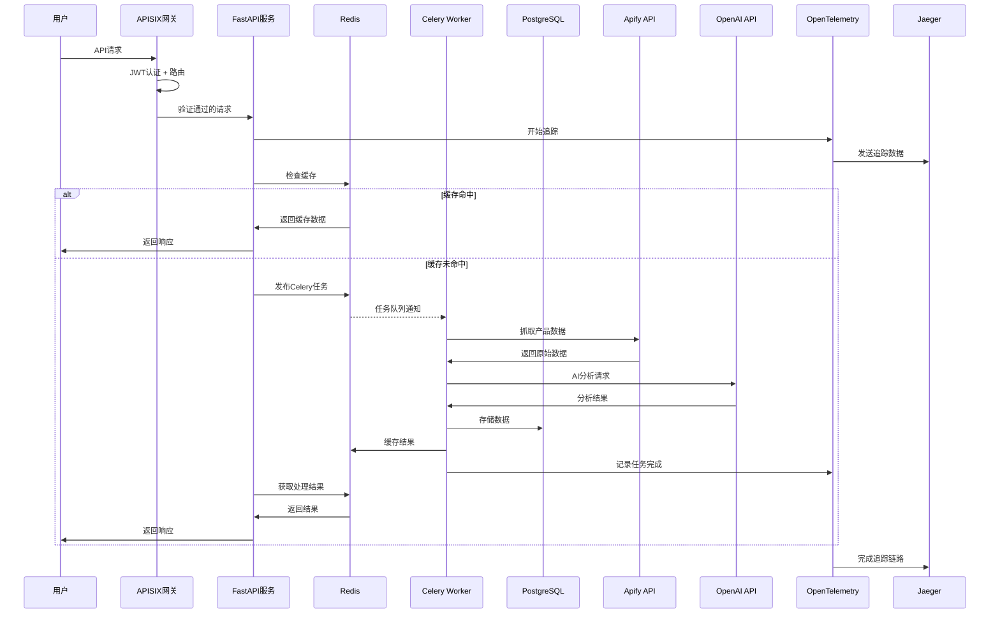

# Amazon 产品追踪与分析系统 - 技术架构文档

## 项目概述

为 Amazon 卖家提供产品表现追踪、竞品分析和优化建议的后端系统，支持 1000+产品监控，具备高可用、可扩展的架构设计。

## 技术栈选型

### 核心技术栈

#### 编程语言与框架

- **Python 3.11+** - 主要编程语言
- **FastAPI** - 现代化的异步 Web 框架
  - 自动 API 文档生成 (Swagger/ReDoc)
  - 高性能异步支持
  - 类型提示和数据验证
  - 内置 CORS 支持

#### 数据库与存储

- **Supabase (PostgreSQL)** - 主数据库
  - 托管 PostgreSQL 服务
  - 内置认证和实时订阅
  - 自动备份和扩展
- **Redis** - 缓存和会话存储
  - 数据缓存（24-48 小时）
  - Celery 消息代理

#### 任务队列与调度

- **Celery** - 分布式任务队列
  - 异步任务执行
  - 定时任务调度
  - 失败重试机制
- **Redis** - 消息代理和缓存
  - Celery Broker 消息队列
  - 任务结果存储
  - 应用数据缓存

#### 数据库迁移

- **Alembic** - 数据库迁移工具
  - 版本化数据库结构
  - 自动迁移脚本生成

#### AI/LLM 集成

- **LangChain** - LLM 应用框架
  - OpenAI API 集成
  - Prompt 模板管理
  - 链式推理支持

#### 网页抓取

- **Apify** - 网页抓取服务
  - Amazon Product Details 爬虫
  - 蓝牙耳机品类专用配置
  - 反爬虫机制处理
  - API 调用优化

#### API 网关与安全

- **APISIX** - 高性能云原生 API 网关
  - 身份认证与鉴权
  - 流量控制与限流
  - SSL/TLS 加密
  - 负载均衡
  - 请求/响应转换
  - 原生 Prometheus 和 OpenTelemetry 支持
  - etcd 配置同步（1ms 级）

### 监控与运维

- **Prometheus** - 指标收集 ✅
- **Grafana** - 数据可视化 ✅
- **Jaeger** - 分布式追踪 ✅
- **OpenTelemetry** - 分布式追踪标准 ✅
- **CloudWatch** - AWS 云监控

### CI/CD 与版本控制

- **GitHub** - 代码版本控制
- **GitHub Actions** - 自动化工作流
- **Docker** - 容器化部署

### 补充技术组件

#### 数据验证与序列化

- **Pydantic V2** - 数据验证和设置管理
- **SQLAlchemy** - ORM 层，与 Alembic 配合
- **Marshmallow** - 复杂数据序列化

#### 测试框架

- **Pytest** - 单元测试和集成测试
- **Pytest-asyncio** - 异步测试支持
- **Faker** - 测试数据生成
- **Locust** - 性能测试和负载测试

#### 日志与追踪

- **Loguru** - 简化的 Python 日志库
- **Structlog** - 结构化日志记录

#### HTTP 客户端与工具

- **HTTPx** - 异步 HTTP 客户端
- **Tenacity** - 智能重试机制
- **APScheduler** - 轻量级任务调度补充

#### 数据处理

- **Pandas** - 数据分析和处理
- **NumPy** - 数值计算支持
- **Arrow** - 现代化时间处理

#### 安全组件

- **Python-jose[cryptography]** - JWT 令牌处理
- **Passlib[bcrypt]** - 密码哈希加密
- **Python-multipart** - 文件上传支持

#### API 文档与开发工具

- **Swagger/OpenAPI** - API 文档自动生成
  - FastAPI 内置支持
  - 交互式 API 测试界面
  - 自动生成客户端 SDK
  - ReDoc 美观文档展示

#### 代码质量工具链

- **Ruff** - 超快 Python 代码检查器 (Linter)
  - 替代 Flake8 + isort + pyupgrade 等多个工具
  - Rust 实现，速度提升 10-100 倍
  - 支持 600+检查规则
- **Black** - 代码格式化器 (Formatter)
  - 零配置的代码格式化
  - 确保代码风格一致性
- **MyPy** - 静态类型检查器
  - 捕获类型相关错误
  - 提高代码可维护性
- **Pre-commit** - Git 提交钩子
  - 自动运行代码质量检查
  - 防止低质量代码提交
- **Bandit** - 安全漏洞检查器
  - 扫描常见安全问题
  - Python 安全最佳实践

#### 包管理和环境

- **UV** - 极速 Python 包管理器
  - 比 Poetry 快 10-100 倍
  - 统一的项目管理
  - 兼容 pyproject.toml

## 多租户架构设计

### 多租户策略

- **数据隔离**: 共享数据库，独立 Schema，通过 tenant_id 字段隔离
- **网关识别**: APISIX 根据子域名或 API Key 识别租户
- **应用隔离**: 所有业务操作都带上租户上下文

### 微服务拆分策略

#### 服务划分

1. **API Gateway (APISIX)** - 独立部署
2. **User Management Service** - 独立服务 (用户认证、租户管理)
3. **Core Business Service** - 主服务 (产品管理、竞品分析)
4. **Crawler Service** - 独立服务 (Apify 集成、数据抓取)

### 整体架构



### 数据流设计



## 核心服务设计

### 1. API 网关层 (APISIX)

- **核心功能**：
  - **认证鉴权系统**
    - JWT Token 验证 (jwt-auth)
    - API Key 认证 (key-auth)
    - Basic Authentication (basic-auth)

  - **流量控制与保护**
    - 请求限流 (limit-req) - 控制请求频率
    - 连接限流 (limit-conn) - 限制并发连接
    - 计数限流 (limit-count) - 基于时间窗口限流
    - IP 访问控制 - 白名单/黑名单机制

  - **路由与负载均衡**
    - 基于路径、主机、HTTP方法的智能路由
    - 多种负载均衡算法 (轮询、权重、一致性哈希)
    - 健康检查和故障转移
    - 服务发现集成

  - **安全增强**
    - CORS 跨域支持
    - 请求参数验证 (request-validation)
    - SSL/TLS 终端处理
    - 敏感数据脱敏

  - **可观测性**
    - Prometheus Metrics 原生导出
    - OpenTelemetry 分布式追踪集成
    - 访问日志记录和分析
    - 实时监控仪表板

  - **配置管理**
    - 通过 etcd 实现毫秒级配置热更新
    - 动态插件加载和卸载
    - A/B 测试和灰度发布支持
    - RESTful 管理 API

### 2. 应用服务层 (FastAPI)

- **产品追踪服务**

  - 产品数据管理 API
  - 价格历史追踪
  - BSR 趋势分析
  - 评价变化监控

- **竞品分析服务**
  - 竞品关系管理
  - 多维对比分析
  - LLM 报告生成
  - 数据标准化处理

### 3. 异步任务层 (Celery)

- **数据抓取任务**

  - 定时产品数据抓取
  - 批量处理优化
  - 失败重试机制

- **AI 分析任务**
  - LangChain 集成处理
  - Prompt 模板管理
  - 结果缓存优化

## 缓存策略

### Redis 缓存层次

```
Level 1: API响应缓存 (30分钟)
├── 产品基本信息
├── 价格趋势数据
└── 竞品分析报告

Level 2: 计算结果缓存 (6小时)
├── 聚合统计数据
├── BSR趋势计算
└── AI分析结果

Level 3: 会话缓存 (24小时)
├── 用户认证信息
├── API限流计数
└── 任务状态跟踪
```

## 安全架构

### 多层安全防护

1. **网关层安全 (APISIX)**

   - TLS/SSL 加密传输
   - JWT 令牌验证
   - API 限流保护
   - IP 白名单/黑名单

2. **应用层安全 (FastAPI)**

   - 输入数据验证 (Pydantic)
   - SQL 注入防护 (SQLAlchemy)
   - 敏感数据脱敏

3. **数据层安全**
   - 数据库连接加密
   - 敏感字段加密存储
   - 定期数据备份

## 监控与观测性 ✅

### 指标收集 (Prometheus) ✅

- APISIX 网关指标 (HTTP 请求数、延迟、状态码)
- 系统资源指标 (CPU、内存、网络)
- 业务指标收集能力

### 数据可视化 (Grafana) ✅

- APISIX 监控仪表板
- 实时指标图表展示
- 告警规则配置

### 分布式追踪 (Jaeger + OpenTelemetry) ✅

- HTTP 请求完整追踪链路
- 性能瓶颈识别
- 跨服务调用分析

### 日志记录 ✅

- 结构化访问日志
- 错误日志收集
- Docker 日志统一管理

## CI/CD 工作流

> **详细的CI/CD配置和部署流程请参见 `Deployment_Architecture.md`**

### 核心CI/CD特点

- **多环境支持**: 开发、测试、生产环境的自动化部署
- **代码质量门禁**: Ruff + Black + MyPy + Pytest全面检查
- **安全扫描**: Bandit + Safety安全漏洞检测
- **蓝绿部署**: 零停机时间的滚动更新策略
- **自动化测试**: 单元测试、集成测试、E2E测试

## 部署架构

> **详细的部署架构和运维配置请参见 `Deployment_Architecture.md`**

### 核心部署特点

- **容器化部署**: 基于Docker和Docker Compose的微服务架构
- **多环境支持**: 开发、测试、生产环境的完整配置
- **水平扩展**: 支持服务实例的动态扩缩容
- **高可用性**: APISIX网关集群 + 数据库主从复制
- **监控完备**: Prometheus + Grafana + Jaeger全链路监控

## 性能优化策略

### 应用层优化

- 异步 I/O 操作 (FastAPI + asyncio)
- 连接池管理 (数据库/Redis)
- 批量处理优化
- 查询优化和索引策略

### 缓存优化

- 多级缓存策略
- 缓存预热机制
- 智能缓存失效

### 数据库优化

- 读写分离
- 数据分区
- 索引优化
- 查询缓存

## 可扩展性设计

### 水平扩展

- **应用层**: 无状态设计，支持多实例
- **任务队列**: Celery 分布式 workers
- **数据库**: 读副本扩展
- **缓存**: Redis 集群

### 垂直扩展

- 资源监控和自动扩容
- 性能瓶颈识别
- 容量规划

## 开发工作流

### 本地开发环境


#
### 代码质量保证

- Pre-commit 钩子自动检查
- 单元测试覆盖率 >80%
- 集成测试和端到端测试
- 性能回归测试

## Apify 触发机制设计

### 三种触发方式

#### 1. 手动触发

```python
# API: POST /api/v1/crawl/manual
{
  "product_ids": ["B07ABC123", "B08DEF456"],
  "priority": "high"
}
```

#### 2. 品类添加触发

```python
# API: POST /api/v1/categories
{
  "name": "Electronics",
  "keywords": ["smartphone", "laptop"],
  "auto_crawl": true
}
# 自动触发该品类产品抓取
```

#### 3. 定时触发

```python
# Celery Beat配置
CELERY_BEAT_SCHEDULE = {
    'daily-crawl-all-tenants': {
        'task': 'crawler.tasks.daily_crawl_scheduler',
        'schedule': crontab(hour=2, minute=0),  # 每天凌晨2点
    },
}
```

### 触发优先级管理

- **手动触发**: 高优先级，立即执行
- **品类添加**: 中优先级，5 分钟内执行
- **定时触发**: 低优先级，批量执行


## 总结

本架构设计基于现代云原生微服务和多租户 SaaS 架构原则，具备以下核心特点：

### 技术架构特色

1. **多租户 SaaS 架构**: 数据层隔离 + APISIX 网关路由，支持子域名和 API Key 双模式
2. **微服务设计**: 用户服务、核心服务、爬虫服务合理拆分，职责清晰
3. **高效消息队列**: Redis + Celery 分布式任务处理，低延迟高可靠
4. **高性能网关**: APISIX Gateway 提供毫秒级配置更新和原生监控集成
5. **现代化工具链**: UV 包管理、FastAPI 异步框架、LangChain AI 集成
6. **完整可观测性**: OpenTelemetry + Jaeger 分布式追踪，Prometheus + Grafana 监控

### 性能与扩展性

1. **高性能**: FastAPI 异步处理 + Redis 多级缓存 + PostgreSQL 分区表
2. **高可扩展**: 水平扩展设计 + Docker 容器化 + Redis 集群自动伸缩
3. **智能调度**: 三种 Apify 触发机制（手动、品类、定时）+ 优先级管理
4. **数据优化**: 时序数据分区 + JSONB 索引 + 连接池管理

### 开发与运维

1. **完整 API 设计**: 8 大模块 60+接口，RESTful 规范 + JWT 认证
2. **可观测性**: Jaeger 分布式追踪 + Prometheus 指标 + Grafana 可视化 ✅
3. **开发体验**: UV 快速环境管理 + 热重载 + Pre-commit 代码检查
4. **生产就绪**: Docker 部署 + GitHub Actions CI/CD + 健康检查

### 业务价值

1. **Amazon 专业爬虫**: Apify Product Details 专用爬虫，蓝牙耳机品类优化
2. **AI 驱动分析**: LangChain + OpenAI 生成竞品分析和优化建议
3. **企业级多租户**: 支持不同计划类型，灵活的用户和权限管理
4. **数据驱动决策**: 完整的产品追踪数据 + 历史趋势分析

### 部署与成本

1. **简化部署**: 单机 Docker Compose 部署，无需 Kubernetes 复杂性
2. **成本优化**: Redis 统一缓存队列 + 智能任务调度减少资源消耗
3. **监控完备**: APISIX 原生 Prometheus 集成，性能开销极低
4. **安全保障**: JWT 认证 + 多层防护 + 敏感数据加密

### 发展路径

该架构设计能够支持：

- **MVP 阶段**: 快速启动，单机部署，基础功能验证
- **成长期**: 多租户扩展，性能优化，功能丰富
- **成熟期**: 大规模部署，企业级特性，国际化支持

**预期容量**: 支持 1000+租户，每租户 1000+产品监控，日处理百万级数据点。
