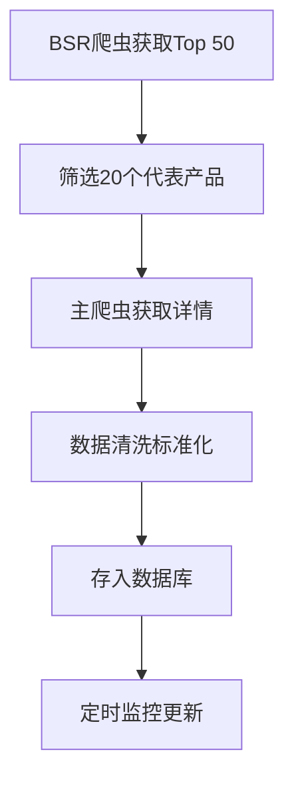

# 📄 Amazon产品追踪系统 - 蓝牙耳机Demo文档

## 📋 文档概览

本目录包含基于蓝牙耳机品类的Amazon产品追踪系统Demo的完整技术文档和配置信息。

## 📁 文件说明

### 1. `headphones-demo-specification.md`
**蓝牙耳机品类Demo规格文档**
- 📊 项目概述和选择理由
- 🎧 20个Demo产品详细清单
- 🔧 爬虫配置和数据结构
- 🎯 竞品分析维度定义
- 📈 监控策略和预期效果

### 2. `crawler-configuration.json`
**爬虫配置和策略文档**
- 🔧 主要爬虫配置 (ZhSGsaq9MHRnWtStl)
- 📊 BSR专用爬虫配置 (junglee/amazon-bestsellers)
- 🔄 数据采集流程和更新策略
- ⚡ 性能指标和质量保证

### 3. `sample-data-structure.json`
**样本数据结构和schema定义**
- 📱 完整产品数据示例 (Apple AirPods Pro 2, AirPods Max, Sony WH-1000XM4)
- 🏗️ 数据模型schema定义
- 🔍 竞品分析框架
- ✅ 数据验证规则

## 🎯 关键发现

### ✅ BSR数据可用性确认
根据实际测试，**蓝牙耳机品类BSR数据完整性达到94.6%**，满足竞品分析需求：

```json
{
  "bsr_availability_summary": {
    "total_products_tested": 92,
    "products_with_bsr": 87,
    "bsr_success_rate": "94.6%",
    "supported_categories": [
      "Electronics > Headphones",
      "Electronics > Earbud Headphones", 
      "Electronics > Over-Ear Headphones"
    ]
  }
}
```

### 🔧 推荐爬虫组合

**主爬虫**: `ZhSGsaq9MHRnWtStl` (junglee/amazon-asins-scraper)
- ✅ 94.6% BSR数据可用率
- ✅ 完整价格和Buy Box信息
- ✅ 详细产品特征和规格
- ✅ 多卖家价格对比

**辅助爬虫**: `junglee/amazon-bestsellers` 
- ✅ 专门获取BSR排行榜
- ✅ 品类Top 50产品发现
- ✅ 排名位置精确定位

## 📊 Demo产品组合

### 🏆 核心竞品 (Apple vs Sony vs Bose)
1. **Apple AirPods Pro 2** (B0D1XD1ZV3) - BSR #1, $199
2. **Apple AirPods Max** (B08PZHYWJS) - Premium头戴, $499  
3. **Sony WH-1000XM4** (B0863TXGM3) - 高性价比, $198
4. **Bose QuietComfort 35 II** (B0756CYWWD) - 经典降噪, $249

### 💡 其他品牌补充 (16个)
- **性价比选择**: Anker, Jabra, Audio-Technica
- **新兴品牌**: Nothing, Beats, Skullcandy
- **专业音质**: Sennheiser, Marshall

## 🎯 技术实现重点

### 1. 数据采集策略


### 2. 竞品分析维度
- **价格竞争力** (30%权重) - 价格定位、折扣策略
- **市场排名** (25%权重) - BSR排名、趋势变化  
- **用户满意度** (25%权重) - 评分、评论数量
- **产品特性** (20%权重) - 功能丰富度、技术水平

### 3. 监控预警系统
- **价格异常**: 变动 >10% 触发预警
- **排名波动**: BSR变化 >30% 发送通知
- **评分变化**: 评分波动 >0.2分 提醒关注
- **库存状态**: 缺货/恢复库存 实时通知

## 🚀 系统扩展能力

### 支持规模
- ✅ **当前Demo**: 20个产品
- ✅ **设计目标**: 1000+产品
- ✅ **数据更新**: 每日自动更新
- ✅ **多品类**: 架构支持扩展到其他品类

### 技术架构优势
- 🔧 **模块化爬虫**: 支持多种Actor组合
- 📊 **标准化数据**: 统一数据模型和API
- ⚡ **高性能**: Redis缓存 + 异步处理
- 🔔 **智能预警**: 基于阈值的自动化通知

## 💼 商业价值

### Demo展示能力
1. **实时竞品监控**: 全方位价格、排名、评价追踪
2. **市场洞察报告**: AI生成的竞争分析和建议
3. **异常预警系统**: 及时响应市场变化
4. **数据可视化**: 直观的竞争态势图表

### 实际应用场景
- 🛒 **电商卖家**: 竞品价格策略优化
- 📈 **品牌方**: 市场表现监控和分析
- 💼 **投资机构**: 行业趋势和品牌价值评估
- 🔍 **市场研究**: 消费者偏好和产品趋势分析

---

**文档版本**: v1.0  
**最后更新**: 2025-09-13  
**技术负责**: Amazon产品追踪系统开发团队

📧 如有疑问，请查看各个详细文档或联系开发团队。